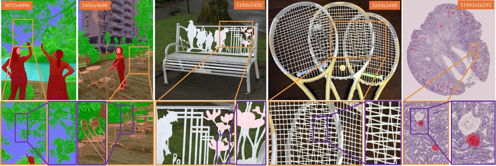

# CoordFormer: Give Me Any Coordinates and I Will Give You Labels

Iacopo Curti, Pierluigi Zama Ramirez, Alioscia Petrelli, Luigi Di Stefano

[Project page](https://iacopo97.github.io/CoordFormer/index.html) · [arXiv](https://arxiv.org/abs/XXXX.XXXXX)



Segmentation results by CoordFormer on MaSS13K (left), DIS5K (center) and KPIs (right). CoordFormer predicts
labels directly at selected pixel locations, enabling highly detailed segmentation of very-high-resolution
images and capturing thin structures and fine boundaries.

## Code

**Code will be released in October 2026.**

## Citation

```bibtex
@article{curti2026coordformer,
  title   = {CoordFormer: Give Me Any Coordinates and I Will Give You Labels},
  author  = {Curti, Iacopo and Zama Ramirez, Pierluigi and
             Petrelli, Alioscia and Di Stefano, Luigi},
  journal = {arXiv preprint arXiv:XXXX.XXXXX},
  year    = {2026}
}
```

## Acknowledgements

We acknowledge ISCRA for awarding this project access to the LEONARDO supercomputer, owned by the EuroHPC Joint
Undertaking, hosted by CINECA (Italy).
